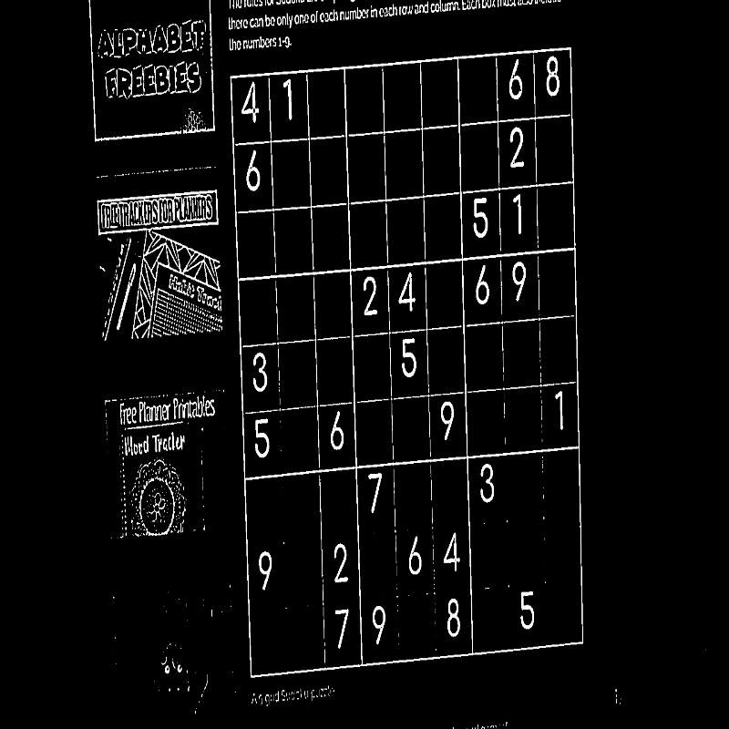

[](https://forthebadge.com)   
[](https://forthebadge.com)

# DEEP SUDOKU
Solving sudoku from images using Computer Vision and Deep Learning. <br/>
Working demo of project can be tested ☺️ : [HERE](https://solveyoursudoku.herokuapp.com/)<br/>

# STEPS 
 1. Input the sudoku image.


 2. Apply Thresholding to image.


 3. Select the biggest contour with four corners.
 


 4. From 4 Point get the Perspective transform.    


 5. Divide the wrapped image into 81 cells.  

 
 6. Extract each cell in the wrapped image and chop it borders as it may contain some white pixels.<br>
  <br>
  fig: cell extracted from wrapped image.<br>
  <br>
  fig: cell with chopped borders.

7. Center the digit on the cell. 
 


8. Predict the number on cell using Neural Network.
9. Use BackTracing Alogrith to solve sudoku.<br>
10. Display the result.
 
   


# Dataset 
At first i tried on MNIST dataset for number prediction. But the model was having some issues differentiating between number 1 and 7 and sometimes 6 and 8. So i used  	
[TheChars74K](http://www.ee.surrey.ac.uk/CVSSP/demos/chars74k/) dataset and apply some manual filtering and applied necessary processing dataset so that there is no issue
differentiating number 1 and 7 and 6 and 8.The dataset is splitted into 80-20 train-test split with following operations applied while traning : 
```
test_path = data_dir+'\\test\\'
train_path = data_dir+'\\train\\'
image_shape = (28,28,1)
```
```
traindata_gen=ImageDataGenerator(
                             rotation_range=10,
                             rescale=1./255,
                             width_shift_range=0.1,
                             height_shift_range=0.1,
                             shear_range=0.1,
                             zoom_range=0.1,
                             fill_mode='nearest'
                              )

testdata_gen=ImageDataGenerator(
                             
                             rescale=1./255)
```

```
traning_set=traindata_gen.flow_from_directory(train_path,
                                              target_size =image_shape[:2],
                                                 batch_size = batch_size,
                                                 color_mode="grayscale",
                                                 class_mode = 'categorical')


testing_set=testdata_gen.flow_from_directory(test_path,
                                            target_size = image_shape[:2],
                                                 batch_size = batch_size,
                                                 color_mode="grayscale",
                                                 class_mode = 'categorical',
                                            shuffle=False)                                                 
```


# Credits : 
1 . https://www.youtube.com/watch?v=uUtw6Syic6A&t=222s <br>
2. https://github.com/manpreet1130/RealTime-Sudoku-Solver <br>
3. Backtracing Algorithm : https://techwithtim.net/tutorials/python-programming/sudoku-solver-backtracking/ <br>
4. Text Centering : https://medium.com/@o.kroeger/tensorflow-mnist-and-your-own-handwritten-digits-4d1cd32bbab4


 


 

